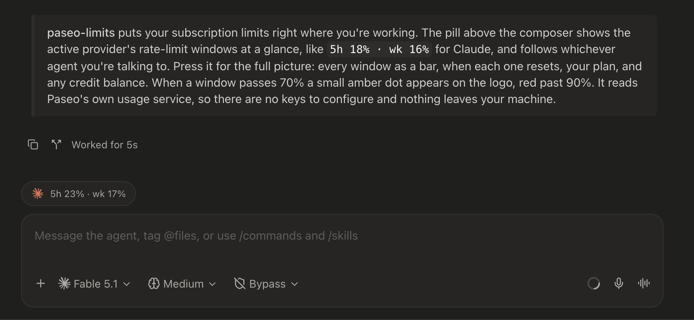

# paseo-limits

Subscription limits for the agent you're talking to, as a pill above the composer in [Paseo](https://paseo.sh).

The pill shows the provider's logo and its rate-limit windows, e.g. `5h 18% · wk 16%`. Press it for the full breakdown: every window as a bar, reset times, plan, and balances. When a window passes 70% a small amber dot appears on the logo; past 90% it turns red.

The pill follows the agent's provider. A Claude agent shows Claude limits, a Codex agent shows Codex limits, and nothing else.



## Install

```bash
paseo plugin add ortschun/paseo-limits
```

Plugins must be enabled on the daemon (**Settings → Plugins → Enable plugins**). Requires Paseo 0.8 or later.

To install from a local checkout instead:

```bash
git clone https://github.com/ortschun/paseo-limits
cd paseo-limits && npm install && npm run typecheck
paseo plugin install "$PWD"
```

## How it works

- Usage comes from Paseo's own provider usage service (`paseo.providers.listUsage()`), the same source the context-window tooltip uses. No credentials or vendor calls in the plugin.
- Custom providers that `extends` a builtin (for example `claude-lead` extending `claude`) show the builtin's limits: the plugin reads `providers.<id>.extends` from daemon config (`paseo.config.get()`) and follows it to the base provider.
- Polls every 2 minutes, plus a throttled refresh whenever the popover opens.
- Client-only: no daemon subprocess, no plugin RPCs, no filesystem or network access.
- Works on desktop and mobile. Colors follow the active theme.

## Limitations

- **Placement.** Paseo plugins can't add to the composer's bottom row, so the pill lives in the track bar above the composer next to Tasks and Subagents.
- **Codex window naming.** Paseo reports Codex's primary window as "Session" without its duration. The plugin classifies it by reset time: anything resetting more than six hours out is labeled weekly. Accounts whose API returns only one window show a single value.
- **Providers.** Only providers Paseo's quota fetcher supports report usage: Claude, Codex, and GLM at the time of writing. Other providers show "No limits".
- **Logos.** Claude and OpenAI marks are bundled. Other providers get a small two-bar meter instead.

## Development

```bash
npm install
npm run typecheck
paseo plugin install "$PWD"      # first time
paseo plugin reload paseo-limits # after edits
paseo plugin logs paseo-limits
```

## License

MIT
